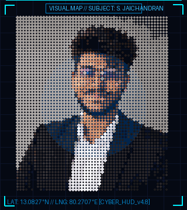

  <!-- ==================== 1. MASTER TERMINAL WINDOW HEADER ==================== -->
  

  <!-- ==================== 2. VISUAL.MAP & SYSTEM.INFO ==================== -->
  <table width="100%" style="background-color: #040814; border: 1.2px solid #0E2A47; border-top: none; border-radius: 0 0 10px 10px; margin-top: -6px;">
    <tr>
      <!-- LEFT SUB-PANEL: VISUAL.MAP (Multi-Stage Particle Morph Loop) -->
      <td width="38%" align="center" valign="middle" style="background-color: #050B1A; border-right: 1px solid #0E2A47; padding: 10px;">
        
         
        
          VISUAL.MAP // JARVIS HOLOGRAPHIC HUD v4.8
        
      </td>

      <!-- RIGHT SUB-PANEL: SYSTEM.INFO (Cyber Monospace Specs) -->
      <td width="62%" align="center" valign="middle" style="background-color: #050B1A; padding: 8px;">
        
      </td>
    </tr>
  </table>

   

  <!-- ==================== 3. TELEMETRY WITH REAL ARC REACTOR ==================== -->
  

 

---

<!-- ==================== 4. GITHUB ACTIVITY & SNAKE GRID ==================== -->
### 📊 GITHUB.ACTIVITY // TELEMETRY &amp; COMMIT GRID

  <!-- Dynamic Stats Badges with Cyber JARVIS Cyan Palette -->
  <table width="100%">
    <tr>
      <td width="50%" align="center">
        
      </td>
      <td width="50%" align="center">
        
      </td>
    </tr>
  </table>

   

  <!-- GitHub Contribution Snake Animation -->
  

 

---

<!-- ==================== 5. AI SYSTEM PIPELINE ==================== -->
### 🧠 AI.SYSTEM.PIPELINE // DISTRIBUTED AGENT RUNTIME

> Real-time data telemetry connecting user prompts, state management, API orchestrators, reasoning LLM agents, dynamic tool invocation, vector retrieval, and persistent stores.

  

 

---

<!-- ==================== 6. TECH.STACK ==================== -->
### 🛠️ TECH.STACK // RUNTIME RUNES &amp; CAPABILITIES

  

 

---

<!-- ==================== 7. PROJECTS.LIST (6 CARDS WITH CIRCULAR GAUGES) ==================== -->
### 🚀 PROJECTS.LIST // `./projects.sh --all`

  

 

---

<!-- ==================== 8. CONNECT / TRANSMISSION ==================== -->

  

    ⚡ <b>SYSTEM READY FOR DEPLOYMENT // INITIATE TRANSMISSION</b>
  

  

    
    &nbsp;&nbsp;
    
    &nbsp;&nbsp;
    
  

   

  
    ⚡ STARK CORE // S. JAICHANDRAN • JARVIS HUD TELEMETRY ENGINE
  

