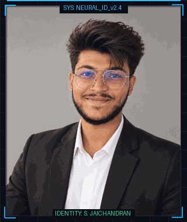
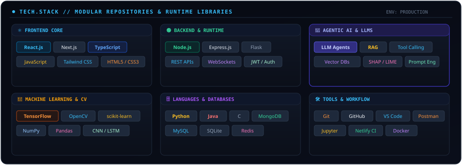
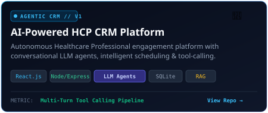
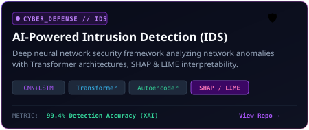
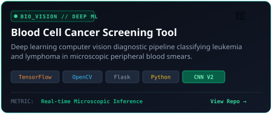
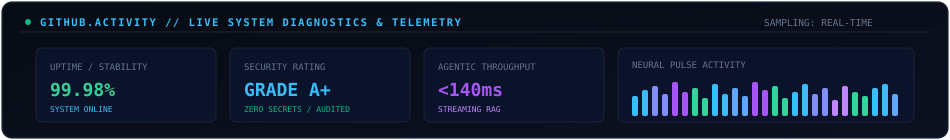

  <!-- ==================== HERO DASHBOARD ==================== -->
  

    

  <!-- Status Chip -->
  

    
    
    
  

---

<!-- ==================== SYSTEM.INFO & AI IDENTITY ==================== -->
### ⚡ SYSTEM.INFO // NEURAL IDENTITY SPECIFICATION

  <table>
    <tr>
      <!-- Column 1: Animated Neural Portrait Transformation -->
      <td width="38%" align="center" style="background-color: #070B14; border: 1px solid #1E293B; border-radius: 10px; padding: 12px;">
        
         
        SYS: BIOMETRIC_NEURAL_RECONSTRUCT // v2.4
      </td>
      <!-- Column 2: System Specifications Panel -->
      <td width="62%" align="center" style="background-color: #070B14; border: 1px solid #1E293B; border-radius: 10px; padding: 6px;">
        
      </td>
    </tr>
  </table>

---

<!-- ==================== AI SYSTEM PIPELINE ==================== -->
### 🧠 AI.SYSTEM.PIPELINE // AUTONOMOUS AGENT ARCHITECTURE

> High-throughput distributed architecture connecting interactive user interfaces with reasoning LLM agents, dynamic tool invocation, vector retrieval (RAG), and persistent state stores.

  

---

<!-- ==================== TECH.STACK ==================== -->
### 🛠️ TECH.STACK // RUNTIME RUNES & CAPABILITIES

  

 

<b>🔍 Expand Granular Tech Stack &amp; Libraries</b>

 

| Domain | Technologies &amp; Frameworks |
| :--- | :--- |
| **Frontend** | React.js, Next.js, TypeScript, JavaScript (ES6+), HTML5, CSS3, Tailwind CSS, Canvas API |
| **Backend &amp; APIs** | Node.js, Express.js, Flask, RESTful APIs, WebSockets, JWT Authentication, CORS Hardening |
| **Programming** | Python 3, Java, C, TypeScript, Modern JavaScript |
| **Databases** | MySQL, MongoDB, SQLite, Redis |
| **AI / Machine Learning** | TensorFlow, OpenCV, scikit-learn, Pandas, NumPy, CNN, LSTM, Transformers |
| **AI Systems &amp; Agents** | Autonomous LLM Agents, Multi-Turn Tool Calling, Retrieval-Augmented Generation (RAG), Vector Embeddings, Explainable AI (SHAP / LIME) |
| **Tools &amp; DevOps** | Git, GitHub, Postman, VS Code, Jupyter Notebook, Netlify, Docker |

---

<!-- ==================== PROJECTS.LIST ==================== -->
### 🚀 PROJECTS.LIST // FEATURED PRODUCTION REPOSITORIES

  <table>
    <tr>
      <!-- Project 1: HCP CRM -->
      <td width="50%" align="center">
        
      </td>
      <!-- Project 2: IDS -->
      <td width="50%" align="center">
        
      </td>
    </tr>
    <tr>
      <!-- Project 3: Blood Cell Cancer Screening -->
      <td width="50%" align="center">
        
      </td>
      <!-- Project 4: Interactive Bday Multiverse Portal -->
      <td width="50%" align="center">
        <a href="https://github.com/Stark345/interactive-birthday-webpage" target="_blank">
           
          
        </a>
      </td>
    </tr>
  </table>

---

<!-- ==================== GITHUB.ACTIVITY ==================== -->
### 📊 GITHUB.ACTIVITY // TELEMETRY &amp; COMMIT DIAGNOSTICS

  <!-- Custom Animated Telemetry Panel -->
  

    

  <!-- Dynamic Stats Badges with Cyber TokyoNight Theme -->
  
  

    

  

---

<!-- ==================== CONNECT ==================== -->
### 📡 CONNECT // INITIATE TRANSMISSION

  
Looking for a high-impact <b>AI-Integrated Full Stack Developer</b> to build intelligent, scalable applications?

  

    
    &nbsp;
    
    &nbsp;
    
  

   
  
  
    ⚡ System Core initialized by S. Jaichandran // Built with Markdown, Animated SVG &amp; Cyber Telemetry
  

