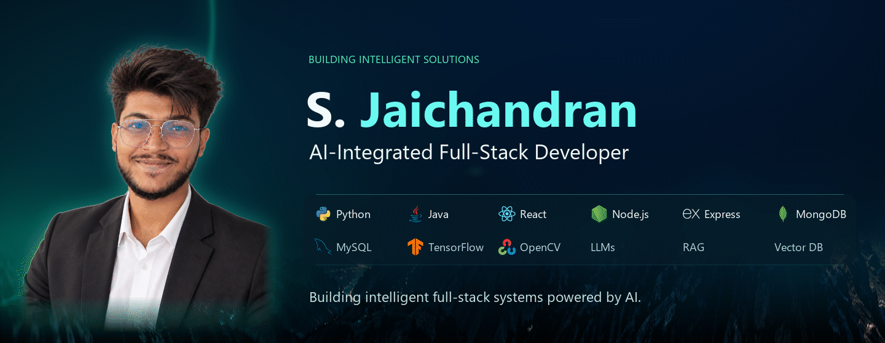

<!-- Approved hero is frozen. See docs/hero-installation.json for SHA-256 hashes. -->
<picture>
  <source media="(prefers-reduced-motion: reduce) and (max-width: 600px)" srcset="assets/hero-mobile.png">
  <source media="(prefers-reduced-motion: reduce)" srcset="assets/hero-cinematic.png">
  <source media="(max-width: 600px)" srcset="assets/hero-mobile.gif">
  
</picture>

  <a href="#selected-projects">Projects</a> &nbsp; · &nbsp;
  <a href="#technical-toolbox">Toolbox</a> &nbsp; · &nbsp;
  <a href="#research--innovation">Research</a> &nbsp; · &nbsp;
  <a href="#lets-connect">Contact</a>

## `$ whoami`

**S. Jaichandran** · AI-Integrated Full-Stack Developer  
B.Tech Information Technology · Chennai, India

I build full-stack applications with AI integration, practical machine learning and automation—from conversational workflows to computer-vision prototypes and websites for real businesses.

## Technical toolbox

Tools used across my projects and technical learning.

<strong>Frontend</strong> 
 React &nbsp; · &nbsp;
 TypeScript &nbsp; · &nbsp;
 Tailwind CSS 
HTML · CSS · JavaScript

<strong>Backend</strong> 
 Node.js &nbsp; · &nbsp; Express.js · FastAPI · Flask

<strong>Programming languages</strong> 
 Python &nbsp; · &nbsp;
 Java &nbsp; · &nbsp; JavaScript · TypeScript

<strong>Databases</strong> 
 SQLite · PostgreSQL 
 MySQL &nbsp; · &nbsp;
 MongoDB

<strong>AI / ML</strong> 
 TensorFlow / Keras &nbsp; · &nbsp;
 OpenCV 
scikit-learn · NumPy · pandas · Matplotlib · SHAP · LIME

<strong>AI / LLM applications</strong> 
LangGraph · Groq API · Tool calling · Structured extraction · Human review 
Retrieval work: BM25 · ChromaDB · Sentence Transformers

<strong>Development tools</strong> 
 Git · GitHub &nbsp; · &nbsp;
 Jupyter · Docker · Vite

## Selected projects

### AI-Powered HCP CRM

> **From meeting notes to structured healthcare interactions.**  
> A conversational CRM that extracts meeting details and lets the user review them before saving.

**React · Redux Toolkit · FastAPI · LangGraph · Express · SQLite**

- Intent detection, entity extraction and tool selection in a LangGraph workflow.
- Editable confirmation before persistence, with Python and Node.js backend implementations.

[Explore the repository →](https://github.com/Stark345/ai-hcp-crm-)

### ProjectPulse

A real-time project workspace with role-scoped tasks, activity and online presence. Includes missed-event recovery using a composite cursor and scheduled overdue-task checks.

**React · TypeScript · Express · PostgreSQL · Prisma · Socket.IO**  
[Repository →](https://github.com/Stark345/ProjectPulse-)

### AI-Powered Intrusion Detection System

A hybrid CNN–LSTM project for normal/attack classification on NSL-KDD network records. Includes a preprocessing and SMOTE training pipeline, plus SHAP and LIME explanation work.

**Python · TensorFlow / Keras · scikit-learn · imbalanced-learn**  
[Repository →](https://github.com/Stark345/AI-Powered-Intrusion-Detection-System-Using-Hybrid-Deep-Learning-Model) · [Research notes below](#research--innovation)

### Blood Cell Cancer Detection System

A research prototype that accepts microscopic cell images and runs a saved TensorFlow model through Flask. Includes grayscale preprocessing, resizing and invalid-image handling; clinical performance is not established.

**Python · TensorFlow · OpenCV · Flask**  
[Repository →](https://github.com/Stark345/Blood-cell-image-cancer-detection)

<strong>Websites in the real world</strong>

**ASJ Pipe Scaffolding**  
A responsive website for a Chennai scaffolding contractor, with a Web3Forms contact flow and LocalBusiness structured data.  
HTML · CSS · JavaScript · Web3Forms  
[Repository](https://github.com/Stark345/ASJ-Pipe-Scaffolding-) · [Visit website](https://asjpipescaffolding.com)

**Personal Portfolio**  
A home for selected projects and technical interests, with project filtering and a Netlify contact form.  
HTML · CSS · JavaScript  
[Repository](https://github.com/Stark345/Stark-Portfolio) · [Visit portfolio](https://sjaichandran-portfolio.netlify.app/)

## What I build

- **Full-stack engineering** — interfaces, APIs, relational data and role-based workflows in HCP CRM and ProjectPulse.
- **AI / LLM integration** — structured extraction and tools with an explicit human-review step; local work on hybrid keyword/vector retrieval.
- **Machine learning & computer vision** — preprocessing, model inference and evaluation in the IDS and cell-image projects.
- **Cybersecurity research** — network-record classification and interpretable model outputs.
- **Websites & automation** — responsive business sites, contact flows and scheduled task checks.

## Research & innovation

**Understanding model decisions in intrusion detection**

My IDS work explores how a hybrid CNN–LSTM classifies network records and how feature explanations can help inspect its decisions.

- **Implemented:** NSL-KDD preprocessing, one-hot encoding, feature scaling and SMOTE; Conv1D + LSTM classification. The notebook includes SHAP KernelExplainer and LIME code.
- **Recorded evaluation:** the saved `KDDTest+` notebook output reports **75.66% accuracy** and **0.9268 ROC-AUC** on **22,544 records**. These are results from that saved run, not a newly reproduced benchmark.
- **Future exploration:** cross-dataset evaluation and comparison with alternative architectures. No completed CICIDS2017, Transformer or autoencoder experiments are claimed here.

Evaluation context

The same saved classification report gives attack precision **0.91** and attack recall **0.63**, showing that missed attacks remain a limitation. SHAP values were generated for a small sample; explanation code is not evidence of operational security effectiveness. The notebook retains execution-state inconsistencies, so an end-to-end rerun is needed before treating its numbers as reproducible results.

[Read the notebook](https://github.com/Stark345/AI-Powered-Intrusion-Detection-System-Using-Hybrid-Deep-Learning-Model/blob/main/IDS.ipynb) · [Inspect the training script](https://github.com/Stark345/AI-Powered-Intrusion-Detection-System-Using-Hybrid-Deep-Learning-Model/blob/main/train.py)

## Education & training

**2026 · B.Tech Information Technology**  
Vel Tech Rangarajan Dr. Sagunthala R&D Institute of Science and Technology  
CGPA: **8.3 / 10**

- **NIELIT Calicut** — Data Analytics & Machine Learning Training
- **Wipro TalentNext** — Java Full Stack Digital Skills Readiness Program

## GitHub activity

**8 public repositories** · Snapshot checked **30 September 2026**  
Recent repository updates span AI applications, machine learning and web development.

[Browse repositories](https://github.com/Stark345?tab=repositories) · [View public activity](https://github.com/Stark345?tab=overview)

## Let's connect

Let’s build something intelligent.

[GitHub](https://github.com/Stark345) · [LinkedIn](https://www.linkedin.com/in/jaichandran-s-139a8b354) · [Portfolio](https://sjaichandran-portfolio.netlify.app/)  
[jaichandran20871@gmail.com](mailto:jaichandran20871@gmail.com)

S. Jaichandran · Chennai, India

