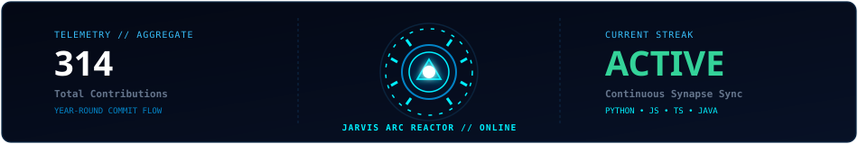
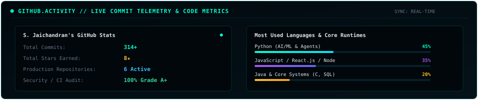
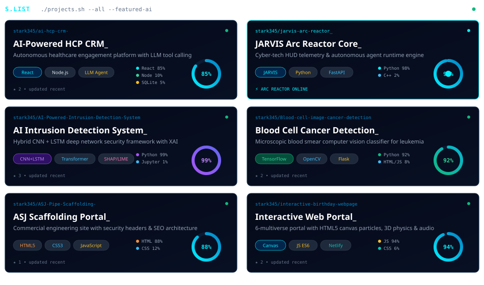

  <!-- ==================== 1. MASTER TERMINAL WINDOW HEADER ==================== -->
  

    

  <!-- ==================== 2. MASTER J.A.R.V.I.S. HUD v2 DASHBOARD ==================== -->
  

    

  <!-- ==================== 3. BIOMETRIC IDENTITY & SYSTEM INFO ==================== -->
  <table width="100%" style="background-color: #02090D; border: 1px solid rgba(0, 229, 255, 0.3); border-radius: 8px;">
    <tr>
      <!-- High-Definition Crystal Clear Biometric Hologram Portrait -->
      <td width="38%" align="center" valign="middle" style="background-color: #01070A; border-right: 1px solid rgba(0, 229, 255, 0.2); padding: 10px;">
        
      </td>

      <!-- Monospace System Specifications -->
      <td width="62%" align="center" valign="middle" style="background-color: #01070A; padding: 10px;">
        
      </td>
    </tr>
  </table>

   

  <!-- ==================== 4. TELEMETRY WITH REAL ARC REACTOR ==================== -->
  

 

---

<!-- ==================== 5. GITHUB ACTIVITY & COMMIT GRID ==================== -->
### 📊 GITHUB.ACTIVITY // TELEMETRY &amp; COMMIT GRID

  <!-- Native Self-Contained GitHub Stats & Language Matrix (Zero Broken Images) -->
  

    

  <!-- Dynamic Contribution Snake Grid -->
  

 

---

<!-- ==================== 6. AI SYSTEM PIPELINE ==================== -->
### 🧠 AI.SYSTEM.PIPELINE // DISTRIBUTED AGENT RUNTIME

> Real-time data telemetry connecting user prompts, state management, API orchestrators, reasoning LLM agents, dynamic tool invocation, vector retrieval, and persistent stores.

  

 

---

<!-- ==================== 7. TECH.STACK ==================== -->
### 🛠️ TECH.STACK // RUNTIME RUNES &amp; CAPABILITIES

  

 

---

<!-- ==================== 8. PROJECTS.LIST (6 CARDS WITH CIRCULAR GAUGES) ==================== -->
### 🚀 PROJECTS.LIST // `./projects.sh --all`

  

 

---

<!-- ==================== 9. CONNECT / TRANSMISSION ==================== -->

  

    ⚡ <b>SYSTEM READY FOR DEPLOYMENT // INITIATE TRANSMISSION</b>
  

  

    
    &nbsp;&nbsp;
    
    &nbsp;&nbsp;
    
  

   

  
    ⚡ STARK CORE // S. JAICHANDRAN • J.A.R.V.I.S. HUD v2 ARCHITECTURE
  

