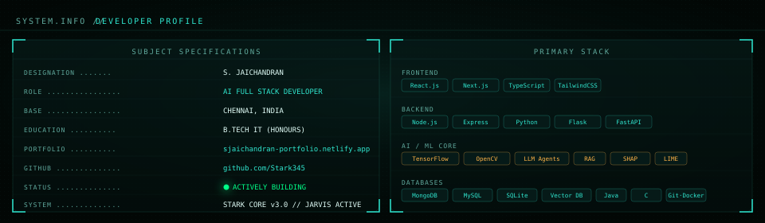
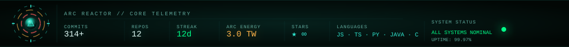
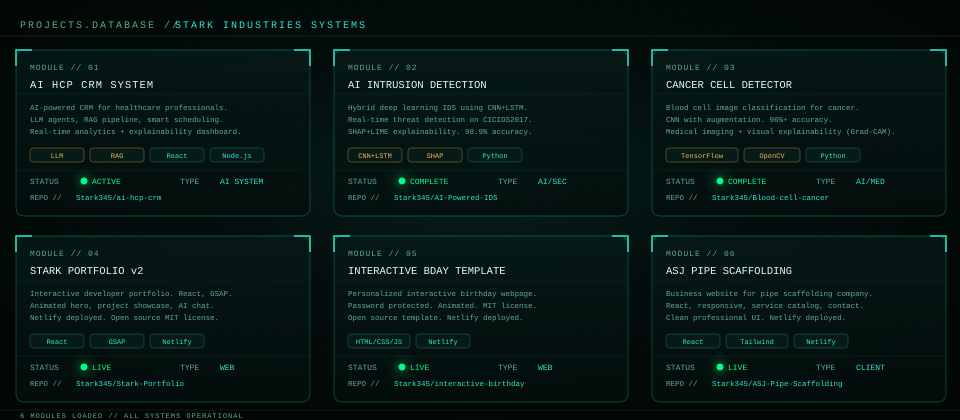
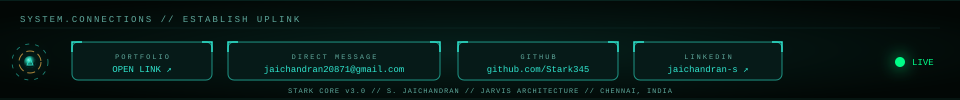

<!-- ══════════════════════════════════════════════════════════════════
     J.A.R.V.I.S. HUD v3.0 — HERO DASHBOARD
     Color system sourced from JARVIS HUD v2 (E:\jarvis\assets\hud)
     --teal: #2fe6cf  --bg: #020705  --glass: rgba(6,26,24,0.55)
     --amber: #ffb347 (Iron Man gold, AI chips only)
     --red: #ff4d4d   (Iron Man red armor only)
     --green: #00ff88 (online status)
     ══════════════════════════════════════════════════════════════════ -->

 

---

<!-- ══════════════════════════════════════ SYSTEM.INFO ══ -->

  

 

---

<!-- ════════════════════════════════ ARC.REACTOR TELEMETRY ══ -->

  

 

---

<!-- ════════════════════════════════ GITHUB.TELEMETRY ══ -->

  

 

---

<!-- ══════════════════════════════ PROJECTS.DATABASE ══ -->

  

 

---

<!-- ══════════════════════════════ AI PIPELINE ══ -->

  

 

---

<!-- ════════════════════════════ SYSTEM.CONNECTIONS ══ -->

  

